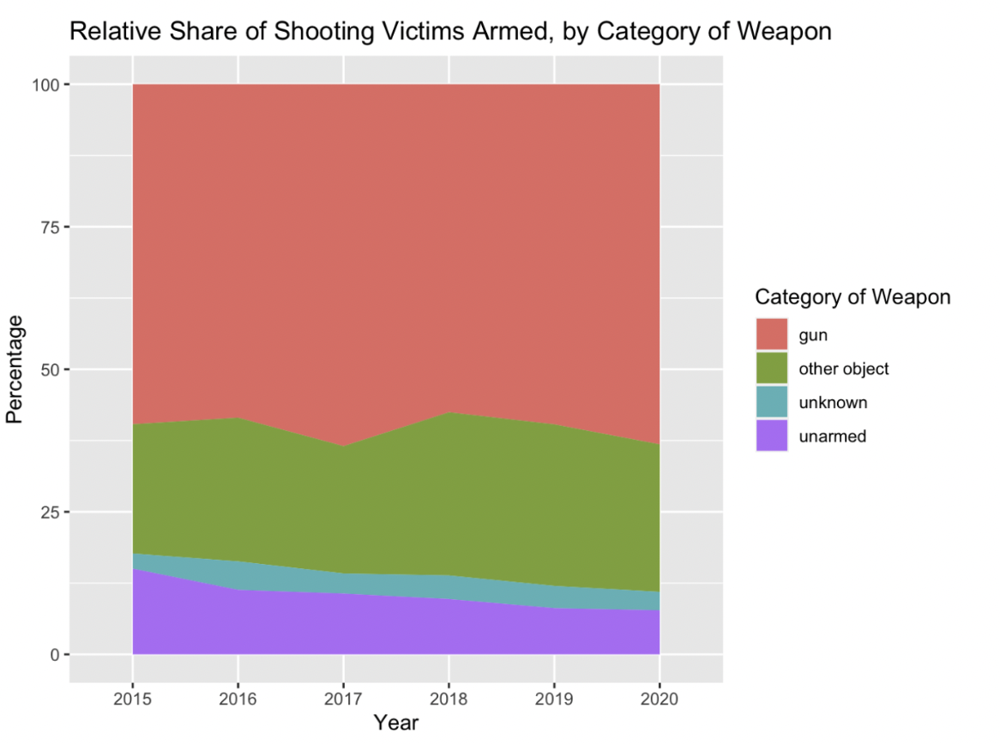
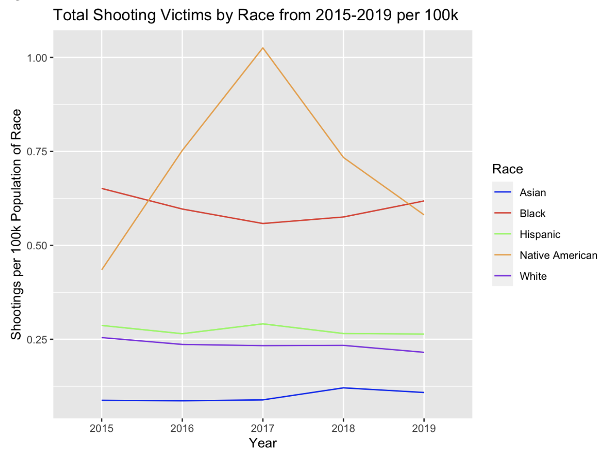

# fatal-police-shootings-graphs
Two graphs based on The Washington Post Fatal Police Shootings Data:
The first graph is a stacked area chart showing the percentages of unarmed/armed shootings.

The second graph shows total shootings by race (Asian, Black, Hispanic, Native American, White) per 100k population each year.

These graphs were analyzed and used to create a policy brief on how to decrease fatal shootings by police Policy Brief [https://docs.google.com/document/d/1xyaM18ys9kLkpEJwMA-H6731c1oD3Mdosuhwp9gs7Kc/edit?usp=sharing]
